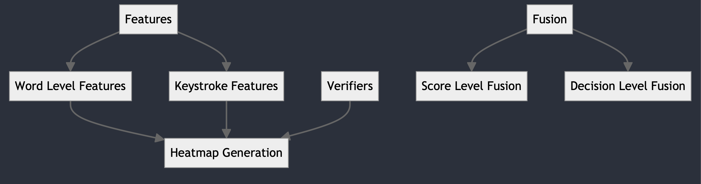
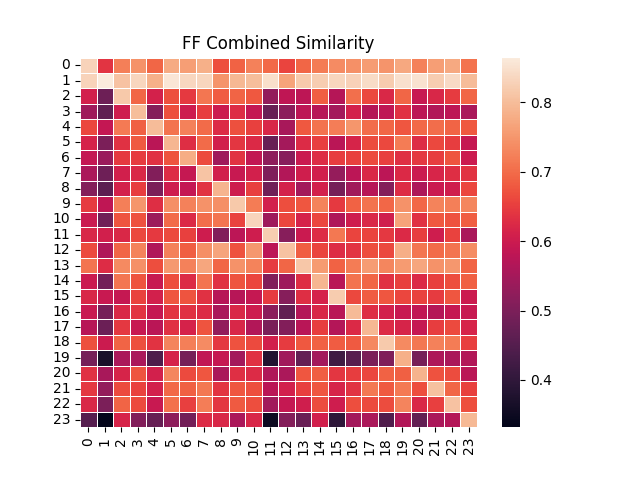

# Fake Social MEdia Detection

Detecting fake profiles using keystroke dynamics.

---

## 🎯 Project Goal

Develop a lightweight system to identify fake profiles on social media platforms using keystroke features.

---

📂 Repository Structure:

features/: Contains scripts for feature extraction.
  word_parser.py: Extracts word-level features.
  
  keystroke_features.py: Extracts keystroke features like Key Hold Time (KHT) and Key Interval Time (KIT).
  
verifiers/: Includes algorithms for profile verification.

  template_generator.py: Processes keystroke data into templates.
  
  verifier_library.py: Contains verifier algorithms:
    AbsoluteVerifier: Compares exact keystroke patterns.
    SimilarityVerifier: Assesses similarity between keystroke sequences.
    ITAD: Implements the Inter-Tap Action Duration method.
    
fusion/: Implements fusion techniques to enhance detection accuracy.

  score_level_fusion.py: Combines scores from multiple verifiers using methods like mean, median, min, and max.
  
  decision_level_fusion.py: Applies empirically set thresholds to determine profile authenticity.
  
heatmap/: Generates heatmaps for visualizing verifier scores across user IDs.

  heatmap_generator.py: Creates heatmaps based on keystroke features and verifier scores.
  
config.py: Configuration file to set experimental parameters:

  use_feature_selection: Enable or disable feature selection.
  
  use_word_holder: Decide whether to use word-level features.
  
  gender: Specify gender data to use (all, male, other).

---

## 🔍 Overview of the Key Parts of the Code Base



### 1. Features

- Word level features are extracted from the `features/word_parser` file.
- Keystroke features (KHT & KIT) are extracted from the `features/keystroke_features` file.

### 2. Verifiers

- **Template Generator**: Processes our compact CSV file containing keystroke data.
- **Verifier Library**: A set of verifier algorithms implemented as class methods for easy usage. These include:
  - Absolute Verifier
  - Similarity Verifier
  - ITAD

### 3. Fusion

- **Score Level Fusion**: Features several fusion algorithms:
  - Mean
  - Median
  - Min
  - Max

  Fusion scores are derived by iterating over the ITAD, Absolute, and Similarity matrices. These scores are then employed to determine the `top_k_accuracy_score` ranging from k=1 to k=5.

- **Decision Level Fusion**: Fusion at the score level is determined using empirically set thresholds specific to each verifier. Profiles are labeled genuine or otherwise based on the outcome.

### 4. Heatmap Generation

Generates a heatmap using a matrix of the scores from a particular verifier algorithm for all user IDs. The scores are derived from keystroke features and, optionally, word-level features.

For example, this is an example heatmap with probe and enrollment IDs
both for Facebook , combining KHT and KIT Flight 1 features, using all available session IDs, and the similarity verifier as the algorithm:


### 5. Configuration File

Configure experimental conditions via the config file:

- `use_feature_selection`: Opt for feature selection with **true** or skip with **false**.
- `use_word_holder`: Decide to use word level features with **true** or avoid with **false**.
- `gender`: Choose the gender data to incorporate:
  - **all**: All IDs
  - **male**: Male IDs only
  - **other**: Other IDs only

## 🚀 Getting Started

### Prerequisites

Ensure you have Python 3.x installed. Install the required dependencies:

```sh
pip3 install -r requirements.txt
```

Running the Application
Feature Extraction: Use scripts in the features/ directory to extract word-level and keystroke features from your dataset.

Template Generation: Process the extracted features using the template_generator.py script in the verifiers/ directory.

Verification: Apply verifier algorithms from the verifier_library.py to assess profile authenticity.

Fusion: Enhance detection accuracy by combining verifier scores using fusion techniques in the fusion/ directory.

Visualization: Generate heatmaps using heatmap_generator.py to visualize verifier scores across user IDs.

Now you are ready to go and can run any of the runnable scripts
